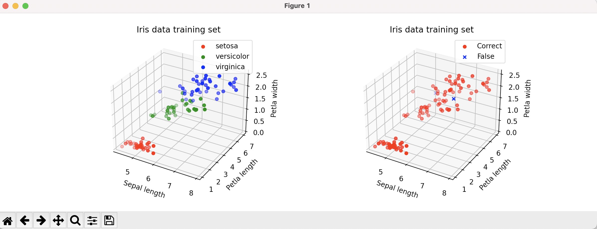
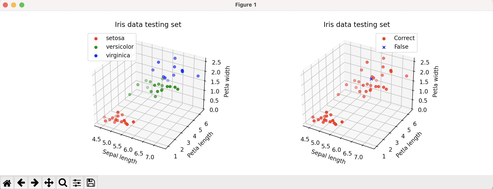
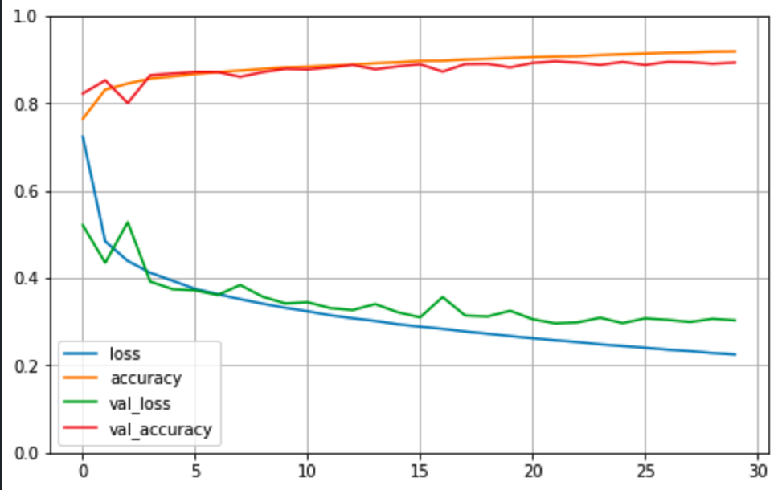

# AI_theory


## Basic Overview

This repository is about the use of artificial intelligence theory and related libraries.

---

# GDA

## gradient descent 의 목적

- 함수의 최소값을 찾는 문제에서 주로 활용
- 미분계수를 계산하는 과정을 컴퓨터로 구현하는것보다 gradient descent로 더 쉽게 구현 가능

## gradient descent 란?

- 학습률과 손실함수의 순간기울기(gradient)를 이용하여 가중치(weight)를 업데이트하는 방법
- 미분의 기울기를 이용하여 도표의 오차들을 비교하고 오차를 최소화하는 방향으로 이동시키는 방법

---

## problem


```python
# cost function & gradient
def f(x): return (x[0] - 3) ** 2 + (x[1]-5) ** 2 + 10
def grad(x): return 2 * (x - np.array([3, 5]))
```

## 초기 설정

```python
# 학습율(lr) 및 멈춤 조건(pause)
iter_count = 0
lr = 0.2
pause = 0.01
x = np.array([10, 20])        # x 초기 설정값
x_vals = [x.tolist()]         # array 를 list 로 반환
cost_vals = [f(x)]
prev_cost = f(x)

```

## gradient descent 수식


```python
x = x - lr * grad(x)
```

---

## 최종 수식

```python
while True:
    iter_count += 1
    x = x - lr * grad(x)
    curr_cost = f(x)
    print("%3d-th iteration: x = [%0.4f, %0.4f]\
        cost = %0.4f" % (iter_count, x[0], x[1], f(x)))

    # 멈춤 조건 설정
    if curr_cost > prev_cost or np.abs(curr_cost - prev_cost) < pause:
        break

    x_vals.append(x.tolist())
    cost_vals.append(curr_cost)
    prev_cost = curr_cost

    print("Final result : x = [%0.4f , %0.4f], cost = %0.4f \
    at iteration = %d\n" % (x[0], x[1], f(x), iter_count))
```

## 결과

```python
[output]
[10 20]
  1-th iteration: x = [7.2000, 14.0000]       cost = 108.6400
  2-th iteration: x = [5.5200, 10.4000]       cost = 45.5104
  3-th iteration: x = [4.5120, 8.2400]        cost = 22.7837
  4-th iteration: x = [3.9072, 6.9440]        cost = 14.6021
  5-th iteration: x = [3.5443, 6.1664]        cost = 11.6568
  6-th iteration: x = [3.3266, 5.6998]        cost = 10.5964
  7-th iteration: x = [3.1960, 5.4199]        cost = 10.2147
  8-th iteration: x = [3.1176, 5.2519]        cost = 10.0773
  9-th iteration: x = [3.0705, 5.1512]        cost = 10.0278
 10-th iteration: x = [3.0423, 5.0907]        cost = 10.0100
 11-th iteration: x = [3.0254, 5.0544]        cost = 10.0036
Final result : x = [3.0254 , 5.0544], cost = 10.0036     at iteration = 11
```


---

# IRIS Classification

## Logistic Regression 란?

- 회귀를 사용하여 데이터가 어떤 범주에 속할 확률을 0에서 1사이의 값으로 예측
- 그 확률에 따라 더 높은 범주에 속하는것을 분류해주는 지도 학습 알고리즘.

---

## 구현내용

- IRIS Dataset의 3가지의 특징벡터를 사용하여 붓꽃의 종류를 예측한다.
- 실제 붓꽃의 종류와 예측된 종류를 시각적으로 비교할 수 있게 한다.

---

## 초기설정

```python
X, y = load_iris(return_X_y=True)
X_train, X_test, y_train, y_test = train_test_split(
    X, y, random_state=0, train_size=0.7)

X_train = X_train[:, [0, 2, 3]]
X_test = X_test[:, [0, 2, 3]]
# Sepal length , petal length, petal width 추출
```

---

## 로지스틱회귀에 의한 훈련

```python
log_reg = LogisticRegression(random_state=0).fit(X_train, y_train)
```

---

## 데이터 시각화 (Train Data)

```python
fig = plt.figure()

ax = fig.add_subplot(1, 2, 1, projection='3d')
ax.scatter(X_train[y_train == 0, 0], X_train[y_train == 0, 1],
           X_train[y_train == 0, 2], c="r", label='setosa')
ax.scatter(X_train[y_train == 1, 0], X_train[y_train == 1, 1],
           X_train[y_train == 1, 2], c="g", label='versicolor')
ax.scatter(X_train[y_train == 2, 0], X_train[y_train == 2, 1],
           X_train[y_train == 2, 2], c="b", label='virginica')

plt.legend(), plt.grid(), plt.title("Iris data training set")
ax.set_xlabel("Sepal length"), ax.set_ylabel(
    "Petla length"), ax.set_zlabel("Petla width")


ax = fig.add_subplot(1, 2, 2, projection='3d')
ax.scatter(X_train[correct_train_index, 0], X_train[correct_train_index, 1],
           X_train[correct_train_index, 2], c="r", marker="o", label="Correct")
ax.scatter(X_train[false_train_index, 0], X_train[false_train_index, 1],
           X_train[false_train_index, 2], c="b", marker="x", label="False")

plt.legend(), plt.grid(), plt.title("Iris data training set")
ax.set_xlabel("Sepal length"), ax.set_ylabel(
    "Petla length"), ax.set_zlabel("Petla width")


plt.show()

```



---

## 데이터 시각화 (Test Data)

```python
plt.rcParams["figure.figsize"] = (12, 4)

fig = plt.figure()

ax = fig.add_subplot(1, 2, 1, projection='3d')
ax.scatter(X_test[y_test == 0, 0], X_test[y_test == 0, 1],
           X_test[y_test == 0, 2], c="r", label='setosa')
ax.scatter(X_test[y_test == 1, 0], X_test[y_test == 1, 1],
           X_test[y_test == 1, 2], c="g", label='versicolor')
ax.scatter(X_test[y_test == 2, 0], X_test[y_test == 2, 1],
           X_test[y_test == 2, 2], c="b", label='virginica')

plt.legend(), plt.grid(), plt.title("Iris data testing set")
ax.set_xlabel("Sepal length"), ax.set_ylabel(
    "Petla length"), ax.set_zlabel("Petla width")


ax = fig.add_subplot(1, 2, 2, projection='3d')
ax.scatter(X_test[correct_test_index, 0], X_test[correct_test_index, 1],
           X_test[correct_test_index, 2], c="r", marker="o", label="Correct")
ax.scatter(X_test[false_test_index, 0], X_test[false_test_index, 1],
           X_test[false_test_index, 2], c="b", marker="x", label="False")

plt.legend(), plt.grid(), plt.title("Iris data testing set")
ax.set_xlabel("Sepal length"), ax.set_ylabel(
    "Petla length"), ax.set_zlabel("Petla width")
```



---

## 성능 평가

```python
print("Testing set performance:", log_reg.score(X_train, y_train))
print("Test set performance:", log_reg.score(X_test, y_test))

[output]
Testing set performance: 0.9809523809523809
Test set performance: 0.9777777777777777

```

---

# MLP(Multilayer Perceptron)

## MLP(Multilayer Perceptron) 란?

- MLP는 일련의 입력에서 일련의 출력을 생성하는 피드 포워드 인공 신경망이다.
- MLP는 입력 레이어와 출력 레이어 사이에 방향 그래츠로 연결된 여러 입력 노드 레이어를 특징으로한다. MLP는 네트워크 교육을 위해 역전파를 사용한다. MLP는 딥러닝 방법이다.

---

## 구현내용

- [1] Flatten-Dense(300)-Dense(50)-Softmax(10)
- [2]Flatten-Dense(300)-Dense(100)-Softmax(10)
- [1],[2] 분류기의 성능을 비교 분석하기

## 초기 설정

```python
# 라이브러리 호출
import tensorflow as tf
import numpy as np
import matplotlib.pyplot as plt

#데이터 불러오기
fashion_mnist = tf.keras.datasets.fashion_mnist
(X_train_full, y_train_full), (X_test, y_test) = fashion_mnist.load_data()

#데이터 이미지 확인
class_names = ["T-shirt/top" , "Trouser", "Pullover", "Dress", "Coat",
               "Sandal" , "Shirt", "Sneaker", "Bag", "Ankle boot"]

plt.figure(figsize=(10,5))

for c in range(5):
    plt.subplot(1,5,c+1)
    plt.imshow(X_train_full[c], cmap ="gray")
    plt.title(class_names[y_train_full[c]])
    plt.axis("off")
plt.show()

#학습:검증:테스트 분류
X_valid, X_train = X_train_full[:5000]/ 255.,  X_train_full[5000:] /255.
y_valid, y_train = y_train_full[:5000] , y_train_full[5000:]
X_test = X_test /255.

print(" 학습:검증:테스트 데이터의 개수  = {}:{}:{}".format(len(X_train)
                                              ,len(X_valid),len(X_test)))

```

---

## 모델 구현

```python
#Build a model

# (2) 분류기
np.random.seed(42)
tf.random.set_seed(42)

model = tf.keras.models.Sequential()
model.add(tf.keras.layers.Flatten(input_shape=[28, 28]))
model.add(tf.keras.layers.Dense(100, activation = "relu"))
model.add(tf.keras.layers.Dense(50, activation = "relu"))
model.add(tf.keras.layers.Dense(10, activation = "softmax"))

model.summary()
"""
# (1) 분류기
np.random.seed(42)
tf.random.set_seed(42)

model = tf.keras.models.Sequential()
model.add(tf.keras.layers.Flatten(input_shape=[28, 28]))
model.add(tf.keras.layers.Dense(300, activation = "relu"))
model.add(tf.keras.layers.Dense(100, activation = "relu"))
model.add(tf.keras.layers.Dense(10, activation = "softmax"))

model.summary()
"""
```

---

## 모델 학습

```python
#Training model, fit()
#모델의 weights와 bias값을 경사하강법(GDA)를 이용해서 학습을 통해 결정
# verbose -> (1 =자세하게), (2 = 간략하게)
history = model.fit(X_train, y_train, epochs=30,batch_size = 32, verbose =2, validation_data = (X_valid, y_valid))
```

---

## 시각화

```python
print("history params = ", history.params)
print("history epoch = ", history.epoch)
print("history keys = ", history.history.keys())

import pandas as pd

pd.DataFrame(history.history).plot(figsize = (8,5))
plt.grid()
plt.gca().set_ylim(0,1)
plt.show()
```



---

## 성능 평가

```python
#Model Evaluation

model.evaluate(X_test,y_test)

[output]
313/313 [==============================] - 1s 2ms/step - loss: 0.3363 - accuracy: 0.8826
[0.3363315761089325, 0.8826000094413757]

```

---

## Contributing

Let's connect 👨‍💻 and forge the future together.😁✌

**Check the Repositories and don't forget to give a star.** 👇

:star: From [S-jooyoung](https://github.com/S-jooyoung)
