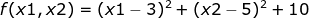
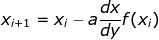
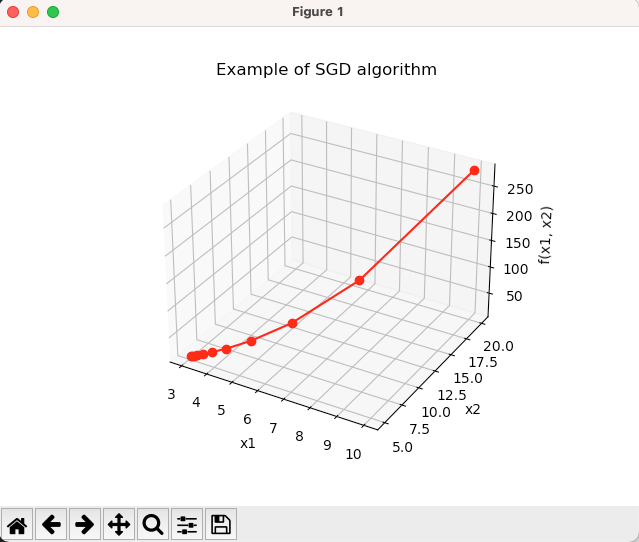
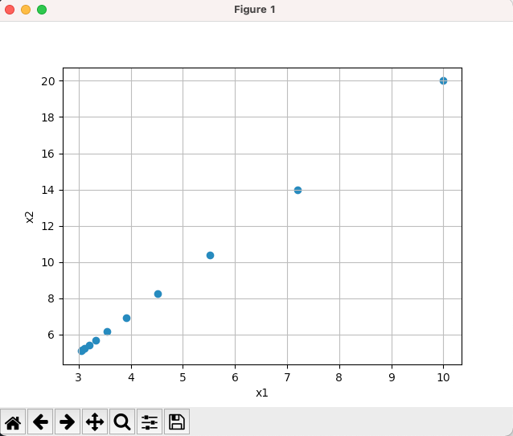

# AI_theory


## Basic Overview

This repository is about the use of artificial intelligence theory and related libraries.

---

# GDA

## gradient descent 의 목적

- 함수의 최소값을 찾는 문제에서 주로 활용
- 미분계수를 계산하는 과정을 컴퓨터로 구현하는것보다 gradient descent로 더 쉽게 구현 가능

## gradient descent 란?

- 학습률과 손실함수의 순간기울기(gradient)를 이용하여 가중치(weight)를 업데이트하는 방법
- 미분의 기울기를 이용하여 도표의 오차들을 비교하고 오차를 최소화하는 방향으로 이동시키는 방법

---

## problem



```python
# cost function & gradient
def f(x): return (x[0] - 3) ** 2 + (x[1]-5) ** 2 + 10
def grad(x): return 2 * (x - np.array([3, 5]))
```

## 초기 설정

```python
# 학습율(lr) 및 멈춤 조건(pause)
iter_count = 0
lr = 0.2
pause = 0.01
x = np.array([10, 20])        # x 초기 설정값
x_vals = [x.tolist()]         # array 를 list 로 반환
cost_vals = [f(x)]
prev_cost = f(x)

```

## gradient descent 수식



```python
x = x - lr * grad(x)
```

---

## 최종 수식

```python
while True:
    iter_count += 1
    x = x - lr * grad(x)
    curr_cost = f(x)
    print("%3d-th iteration: x = [%0.4f, %0.4f]\
        cost = %0.4f" % (iter_count, x[0], x[1], f(x)))

    # 멈춤 조건 설정
    if curr_cost > prev_cost or np.abs(curr_cost - prev_cost) < pause:
        break

    x_vals.append(x.tolist())
    cost_vals.append(curr_cost)
    prev_cost = curr_cost

    print("Final result : x = [%0.4f , %0.4f], cost = %0.4f \
    at iteration = %d\n" % (x[0], x[1], f(x), iter_count))
```

## 결과

```python
[output]
[10 20]
  1-th iteration: x = [7.2000, 14.0000]       cost = 108.6400
  2-th iteration: x = [5.5200, 10.4000]       cost = 45.5104
  3-th iteration: x = [4.5120, 8.2400]        cost = 22.7837
  4-th iteration: x = [3.9072, 6.9440]        cost = 14.6021
  5-th iteration: x = [3.5443, 6.1664]        cost = 11.6568
  6-th iteration: x = [3.3266, 5.6998]        cost = 10.5964
  7-th iteration: x = [3.1960, 5.4199]        cost = 10.2147
  8-th iteration: x = [3.1176, 5.2519]        cost = 10.0773
  9-th iteration: x = [3.0705, 5.1512]        cost = 10.0278
 10-th iteration: x = [3.0423, 5.0907]        cost = 10.0100
 11-th iteration: x = [3.0254, 5.0544]        cost = 10.0036
Final result : x = [3.0254 , 5.0544], cost = 10.0036     at iteration = 11
```




---

## Contributing

Let's connect 👨‍💻 and forge the future together.😁✌

**Check the Repositories and don't forget to give a star.** 👇

:star: From [S-jooyoung](https://github.com/S-jooyoung)
